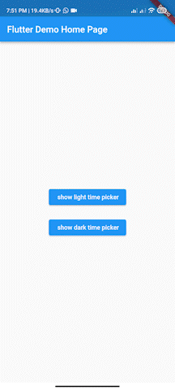
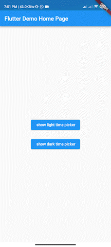

# From To Time Picker


[](https://opensource.org/licenses/MIT)


Simple interactive time range picker that enables users to pick a specific duration of the day by selecting start time and end time and defining whether it was AM or PM then it returns the duration chosen in 24H format.




## Usage

In the pubspec.yaml of your flutter project, add the following dependency:

```dart
dependencies:
...
from_to_time_picker: ^1.1.1

```

In your library add the following import:

```dart
import 'package:from_to_time_picker/from_to_time_picker.dart';
```


## Example

default mode
```dart

showDialog(
        context: context,
        builder: (_) => FromToTimePicker(
              onTab: (from, to) {
                print('from $from to $to');
              },
            ));

```

customized mode 
```dart
showDialog(
      context: context,
      builder: (_) => FromToTimePicker(
        onTab: (from, to) {
          print('from $from to $to');
        },
        dialogBackgroundColor: Color(0xFF121212),
        fromHeadlineColor: Colors.white,
        toHeadlineColor: Colors.white,
        upIconColor: Colors.white,
        downIconColor: Colors.white,
        timeBoxColor: Color(0xFF1E1E1E),
        timeHintColor: Colors.grey,
        timeTextColor: Colors.white,
        dividerColor: Color(0xFF121212),
        doneTextColor: Colors.white,
        dismissTextColor: Colors.white,
        defaultDayNightColor: Color(0xFF1E1E1E),
        defaultDayNightTextColor: Colors.white,
        colonColor: Colors.white,
        showHeaderBullet: true,
        headerText: 'Time available from 01:00 AM to 11:00 PM',
      ),
    );
```

## Contributing

We accept the following contribution:

* Improving documentation
* Reporting issues
* fixing bugs

## Maintainer

* Ahmed Elsarag
